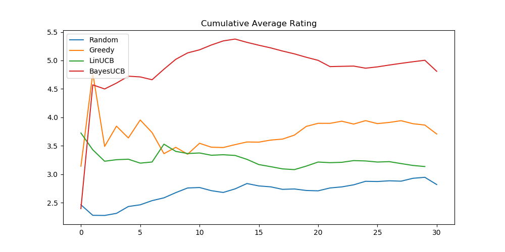

# interactive-music-recommendation

A personalized and interactive music recommendation tool with bandit approach. [A Bandit Approach to Music Recommendation notebook](https://github.com/gokceuludogan/interactive-music-recommendation/blob/master/A%20Bandit%20Approach%20to%20Music%20Recommendation.ipynb) contains an overview of model.  

## Contributors

* [Barış Can Esmer](https://github.com/barisesmer)
* [Beyza Gül Gürbüz](https://github.com/gurbuzbeyza)
* [H. Esra Aydemir](https://github.com/esra-aydemir)
* [Gökçe Uludoğan](https://github.com/gokceuludogan)

## Datasets 

* The datasets utilized for finding out user behaviours and audio features:

  * [LastFM User Listening History](https://www.dtic.upf.edu/~ocelma/MusicRecommendationDataset/lastfm-1K.html)
  * [MSD genre dataset](https://labrosa.ee.columbia.edu/millionsong/blog/11-2-28-deriving-genre-dataset) 

* To prepare data follow the instructions in [data-preprocessing.sh](https://github.com/gokceuludogan/interactive-music-recommendation/blob/master/data-preprocessing.sh) and [Music Dataset Preparation notebook](https://github.com/gokceuludogan/interactive-music-recommendation/blob/master/notebooks/Music%20Dataset%20Preparation.ipynb).

## Methods

The methods implemented to solve the model are: 

* [Epsilon-greedy](https://github.com/gokceuludogan/interactive-music-recommendation/blob/master/models/epsilon_greedy.py)
* [LinUCB](https://github.com/gokceuludogan/interactive-music-recommendation/blob/master/models/linucb.py)
* [BayesUCB (with variational inference)](https://github.com/gokceuludogan/interactive-music-recommendation/blob/master/models/bayesucb.py)

## Experiments 

## References

[1] Wang, Xinxi, et al. "Exploration in interactive personalized music recommendation: a reinforcement learning approach." ACM Transactions on Multimedia Computing, Communications, and Applications (TOMM) 11.1 (2014): 7.

[2] Li, Lihong, et al. "A contextual-bandit approach to personalized news article recommendation." Proceedings of the 19th international conference on World wide web. ACM, 2010.
